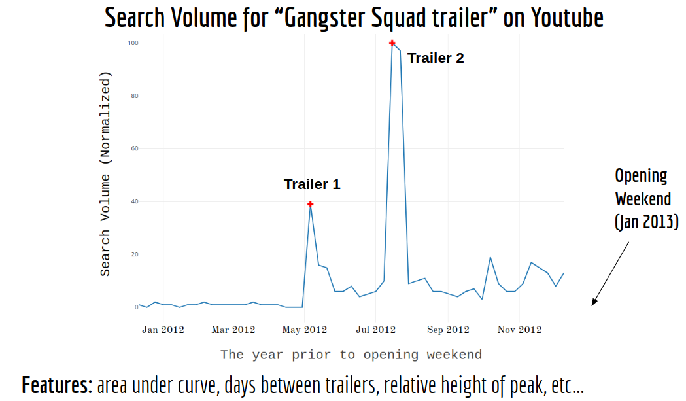

# TrailerTrends
We all have watched that one awesome movie trailer that convinces us to spend $15 to sit inside a big dark room staring at the big screen for a couple of hours. It is not crazy, then, to say that trailers can significantly impact the initial success of a movie. But does it matter, for example, when the trailers are released? How many? Movie marketers claim it does but I wanted to take a data driven approach to see which trailer features (if any) matter the most. In this repo, we gather data about movie trailers by scraping the internet and using API's from different sources. I then build a model that uses this dataset (things like online search trends prior to release date, etc) along with other movie metadata to predict the initial ROI of a movie. The target variable, which I label as "success", is defined as

success = opening weekend revenue/budget

The main results/insights found are:
* Positive online trailer views on youtube/google prior to release date is a predictive feature for success (as defined above). Other movie features such as production company and budget are also strong predictors (as expected).
* Release dates of trailers are not strong predictors for success (so maybe movie marketers should not spend that much time and effort into picking specific release dates). 
* Low budget horror films like "Paranormal Activity" tend to have large success.
* Movies with two trailers tend to do better on opening weekend when the first trailer is more popular than the second (rather than the other way around).

This work was part of my three week long project as an [Insight Data Science Fellow](http://insightdatascience.com/) in NYC. Check out 'modeling' notebook for the EDA and model building.

**Dataset:**

The first step in this project was getting the data. To this end, I
* used the [Movie Database (TMDB)](https://www.themoviedb.org/?language=en) API to get basic movie metadata such as genre and budget.
* scraped [Box Office Mojo](http://www.boxofficemojo.com/) (with scraper_BOM.py) to get opening weekend revenue and number of theaters.
* scraped [Youtube](https://www.youtube.com/) (with scraper_youtube.py) to get average number of views, likes and dislikes for the movie's trailers.
* used [pytrends](https://github.com/GeneralMills/pytrends) to extract time series data (from [Google trends API](https://trends.google.com/trends/explore?q=Thor:%20Ragnarok%20trailer); see get_google_trends_data.py) for the internet search "movie + trailer" on Youtube, 56 weeks prior to the release of each movie (with searches/week resolution). Used [peakutils](https://pypi.python.org/pypi/PeakUtils) to detect surges (peaks) in these trailer searches. See example output below.

The final dataset (~550 movies) is stored in df_final.csv (using final_data_preprocessing.py) inside the data folder. Simply import it in your code to use (you do not need to rerun the scripts above to use the data). 

**Data Description**:
* title: movie's title.
* num_peaks: number of online search peaks from Google Trends corresponding to a movie trailer. 
* search_volume: area under the curve in the Google trends data.
* budget: movie's budget (excluding marketing costs, which are typically as large as the budget itself).
* genres: movie's genres.
* original_language: language spoken in the original version of the movie.
* production_companies: movie's list of production companies.
* production_countries: movie's list of production countires (at least one of the must be the US)
* release_date: movie's release data (we only consider movies with release dates after 2009, since data from Youtube and Google trends is more reliable in this range).
* runtime: movie duration in minutes (we restrict to movies with at least 80 minutes long).
* weekend_rev: movie's opening weekend revenue in dollars
* num_theaters: number of theaters screening the movie during opening weekend.
* success (this is the target variable defined as success=opening weekend revenue/budget, or ROI).
* day: movie's release day (e.g, Mon).
* month: mobie's release month (e.g, Jan).
* year: movie's release year (e.g, 2010).
* holiday: binary variable indicating if the release date was during a month with a holiday.
* views: movie's mean number of Youtube trailer views.
* likes: movie's mean number of Youtube trailer likes.
* dislikes: movie's mean number of Youtube trailer dislikes.
* dt_main: number of days between the Youtube trailer with largest search volume and the movie's release date.
* dt_trailers: number of days between the two most popular Youtube trailers for a movie. dt_trailers=0 if the movie only has one trailer, dt_trailers<0 if the first trailer was has the largest search volume.
* dt_trailers_cat: categorical version of dt_trailers describing the sign of dt_trailers.  

